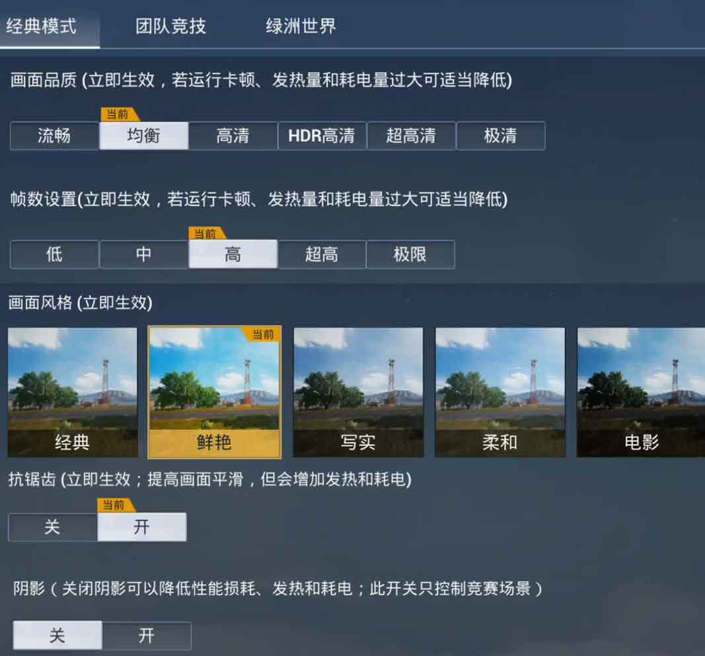
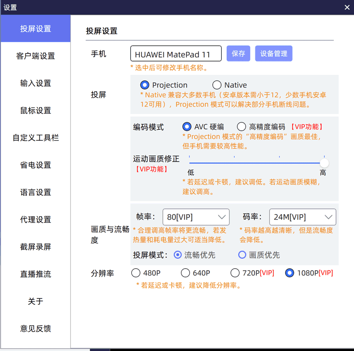
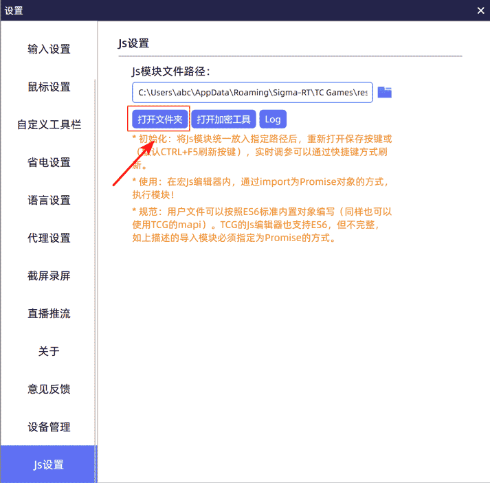
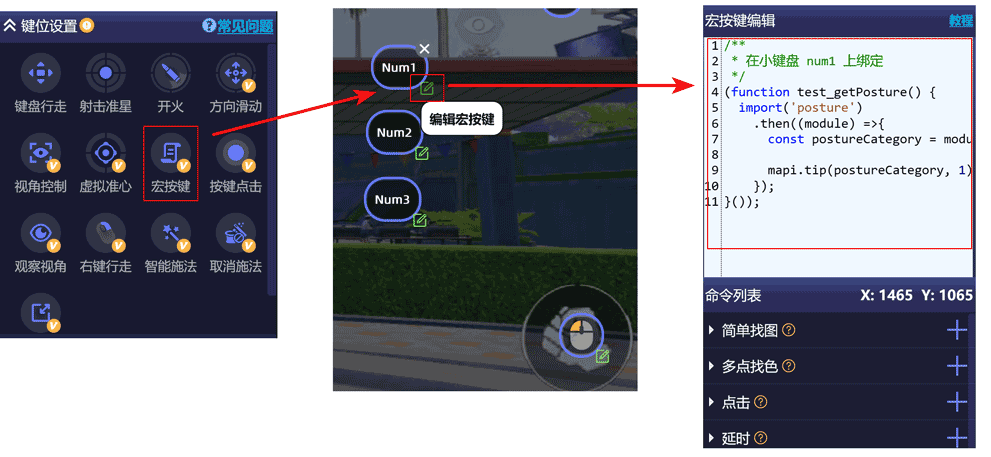

# TC Games JS 脚本

## 1. 介绍

说明：

* 用于 和平精英 中进行自动压枪操作
* 此项目使用 node.js 编写， gulp 构建

安装：

1. 下载此项目并解压，建议解压到桌面
2. 下载并安装 [node.js v16.20.1](https://nodejs.org/download/release/v16.20.1/node-v16.20.1-x64.msi)
3. 使用 windows 搜索 “cmd”，打开 “命令提示符”
4. 执行如下命令：（`#` 打头的不用执行）

    ```text
    # 切换盘符
    C:\Users\abc> W:
    
    # 切换到项目根目录
    W:\> cd W:\dev\tc-games-scripts
    
    # 安装 gulp-cli
    W:\dev\tc-games-scripts> npm i -g gulp-cli
    
    # 安装 gulp
    W:\dev\tc-games-scripts> npm i gulp
    
    # 安装项目依赖
    W:\dev\tc-games-scripts> npm i
    
    # 构建图片：
    #    1. 删除 "TC Games\resource\game\smartkey\com.tencent.tmgp.pubgmhd" 目录
    #    2. 将 "src/images/" 下的图片拷贝过去
    W:\dev\tc-games-scripts> npm run build:image
    
    # 构建 nova9 可以使用的脚本（根据自己的设备选择，执行一个即可）
    W:\dev\tc-games-scripts> npm run build:script:nova9
    
    # 构建 matepad11 可以使用的脚本（根据自己的设备选择，执行一个即可）
    W:\dev\tc-games-scripts> npm run build:script:matepad11
    ```

键位：

* 位置：[./docs/键位配置/TG_Keys.zip](./docs/键位配置/TG_Keys_2023_07_06.zip)

宏按键绑定：

<!--keymap-start-->

| 按键 | 说明 |
| --- | --- |
| F11 | 记录不准确的压枪参数 |
| F12 | 启用/禁用 mapi.tip() |
| Q | 切枪 |
| Tab | 收枪 |
| 上箭头 | 动态调整压枪参数，+1 |
| 下箭头 | 动态调整压枪参数，-1 |
| 鼠标右键 | 1. 取消投掷；<br>2. 丢弃背包中光标所指位置的配件；<br>3. 点击当前按键位置并设置压枪参数 |
| 鼠标左键 | 开火 |
| 鼠标滚轮-滚上 | 调整 6 倍镜，并记录调整过 6 倍镜倍率的枪及倍率 |

<!--keymap-end-->

## 2. 环境

### 2.1. 移动设备

#### 2.1.1. nova9

参数：

| 类别     | 描述                  |
|--------|---------------------|
| 品牌     | 华为 nova9 (NAM-AL00) |
| 分辨率    | 1080 × 2430         |
| 刷新率    | 智能（最高 120 Hz）       |
| 屏幕顶部显示 | 自动匹配                |


#### 2.1.2. matepad11

参数：

| 类别  | 描述            |
|-----|---------------|
| 品牌  | 华为 MatePad 11 |
| 分辨率 | 2560 × 1600   |

游戏画面设置：

* 

TC Games 设置：

* 

### 2.2. 电脑

#### 2.2.1. 笔记本

参数：

| 类别  | 描述                   |
|-----|----------------------|
| 品牌  | 联想笔记本，拯救者 R7000 2021 |
| 系统  | win10                |
| 分辨率 | 2560 × 1600          |


#### 2.2.2. 一体机

参数：

| 类别  | 描述                   |
|-----|----------------------|
| 品牌  | iMac，2017年款          |
| 系统  | win10                |
| 分辨率 | 4096 × 2304, 缩放 200% |

## 3. JS 文件

### 3.1. 存放位置

位置：

* `C:\Users\abc\AppData\Roaming\Sigma-RT\TC Games\resource\Scripts` (简称“脚本目录”)
* 

说明：

* 在 “脚本目录” 中存放的 JS 文件都会被加载

### 3.2. 刷新

输入设置 中 快捷键：

* 键位一键恢复： Ctrl + F5

修改了 “脚本目录” 中的 JS 文件后，按 `Ctrl + F5` 后就生效了

### 3.3. 模块化语法

说明:

* 使用 ES6 模块化语法
* 不能使用相对路径

示例:

* 目录：

  ```text
  .../TC Games/resource/Scripts/
    main.js
    gun.js
  ```

* gun.js:

  ```javascript
  // 暴露一个函数
  export function getCurrentGunName() {
    // ...
  }
  ```

* main.js:

  ```javascript
  // 导入 gun 模块（gun.js）
  import gun from 'gun';
  
  const gunName = gun.getCurrentGunName();
  
  mapi.tip(gunName, 2);
  ```

## 4. 宏按键

什么是宏按键：

* 键位设置 -> 宏按键
* 

宏按键里的 JS 代码必须用**立即执行的函数**包裹起来：

```javascript
(function() {
  
  // 你的代码
  
}());
```

在宏按键里使用 “脚本目录” 中的 JS 文件（模块）：

```javascript
// 使用 gun.js
(function() {
  import('gun').then((gun) =>{
    
    const gunName = gun.getCurrentGunName();

    mapi.tip(gunName, 2);
    
  });
}());
```

模块实例问题：

```javascript
// test.js
export default {
  count: 1,
  add() {
    this.count += 1;
  }
};

// 绑定 num1
(function() {
  import('test').then(({ default: test }) => {
    const prev = test.count;
    test.add();
    const curr = test.count;
    
    mapi.tip(`prev = ${prev}; curr = ${curr}`); // 显示累加的结果
  });
}());

// 绑定 num2
(function() {
  import('test').then(({ default: test }) => {
    mapi.tip(`count = ${test.count}`); // 一直显示初始值
  });
}());


// num1 宏，多次执行只产生一个 test 模块对象 A
// num2 宏，多次执行只产生一个 test 模块对象 B
// A !== B
```

JS 宏日志：

* 作用：JS 代码报错都会记录在日志文件
* 位置：`C:\Users\abc\AppData\Roaming\Sigma-RT\TC Games\log\macro_javascript.log`

## 5. 图片

说明：

* “简单找图” 用到的图片，`mapi.findimage(图片名称, ....)`

注意：

* 纯文字找图，相似度要调低

位置：

* `C:\Users\abc\AppData\Roaming\Sigma-RT\TC Games\resource\game\smartkey\com.tencent.tmgp.pubgmhd`

目录：

```text
com.tencent.tmgp.pubgmhd/
  1080/   # 存放分辨率高度为 1080 设备的图片
  1600/   # 存放分辨率高度为 1600 设备的图片
```

查找图片的规则：

* `mapi.findimage('AKM', ....)`
* 如果当前设备是 1080 的手机，则优先去 `1080` 目录找，找不到则去 `1600` 目录找
* 所以可以使用 1600 的平板，然后降低相似度就可以在 1080 的设备上用了

## 6. JS API

### 6.1. mapi

全局对象，JSAPI 接口

类型说明文件：[types/mapi.d.ts](./types/mapi.d.ts)

官方文档：[http://www.sigma-rt.com/tcgames/help/?u=15](http://www.sigma-rt.com/tcgames/help/?u=15)

### 6.2. 多点找色

说明：

* 那个点 是否 是那个色
* 配合

API：

* `mapi.findcolor`

示例：

```javascript
const point = mapi.findimage('255:254:247:142', '1475:648+1477:648+1475:650+1477:650');

if (point.X !== 0 || point.Y !== 0) {
  // 找到了
}
```

### 6.3. 全局 map

说明：

* 读写全局变量

API：

* `mapi.setglobalmap`: 写
* `mapi.getglobalmap`: 读

示例：

### 6.4. 日志

说明：

* 日志输出路径：%appdata%\Sigma-RT\TC Games\Log\macro_javascript.log

API：

* `logdebug`
* `loginfo`
* `logwarning`
* `logerror`
* `logfatal`

注意：

* API 是全局方法，不需要 mapi

## 7. bug

### 7.1. 分段压枪，自动开枪

描述：

* 分段压枪，切换 蹲/站 时，点一下开火键会自动打二三十发子弹

## 8. 参考

* [和平精英手游物资及事件场景中英文对照（持续更新，务必收藏！）](https://zhuanlan.zhihu.com/p/359768662)
* [官方文档](https://www.sigma-rt.com/tcgames/help/?u=15)
